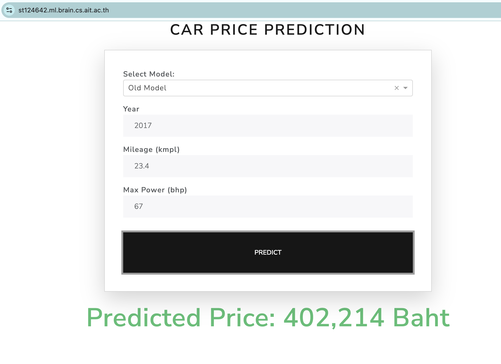

# A2_Assignment

st124642- Thang Sian Khawm

# Model Performance Report

## Best Performing Model

From the MLflow experiments, the best-performing model is:

**Model Name:** Normal-grad-mini-Ir-0.01-init-zero-momentum-0.9-poly-False

## Performance Metrics

- **Test Mean Squared Error (MSE):** 0.1086219
- **Test R² Score:** 0.8471

## Model Configuration

- **Gradient Type:** Normal
- **Batch Type:** Mini-batch
- **Initial Learning Rate:** 0.01
- **Initialization:** Zero
- **Momentum:** 0.9
- **Polynomial Learning Rate Decay:** False

## Summary

This model achieved the lowest test MSE, indicating its superior performance in minimizing prediction errors. The combination of mini-batch gradient descent, a learning rate of 0.01, zero initialization, and momentum of 0.9 contributed to its success. The absence of polynomial learning rate decay suggests that a constant or other adaptive learning strategy was optimal for this setup.

## Deployment
you can access the deployed application through https://st124642.ml.brain.cs.ait.ac.th/

